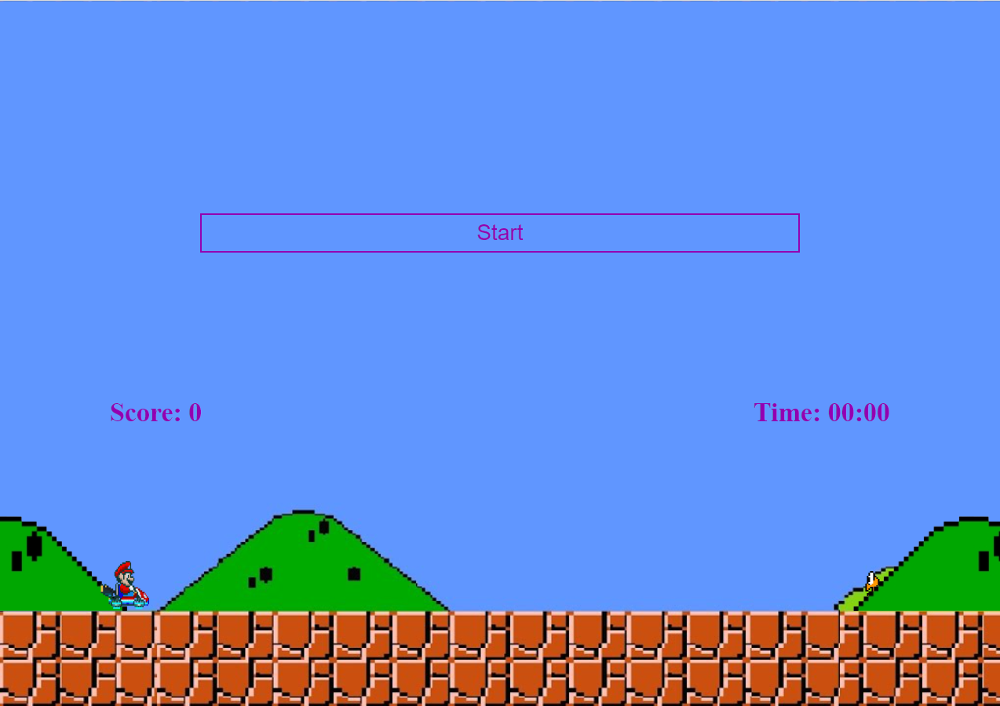

# Simple Mario Game
For this project I used:\
* __HTML__
* __CSS__
* __JS__
\
\
This site work with processing of DOM elements and correctly work only on PC. \
[Link on this website](https://k-a-webdev.github.io/SimpleMario/)

